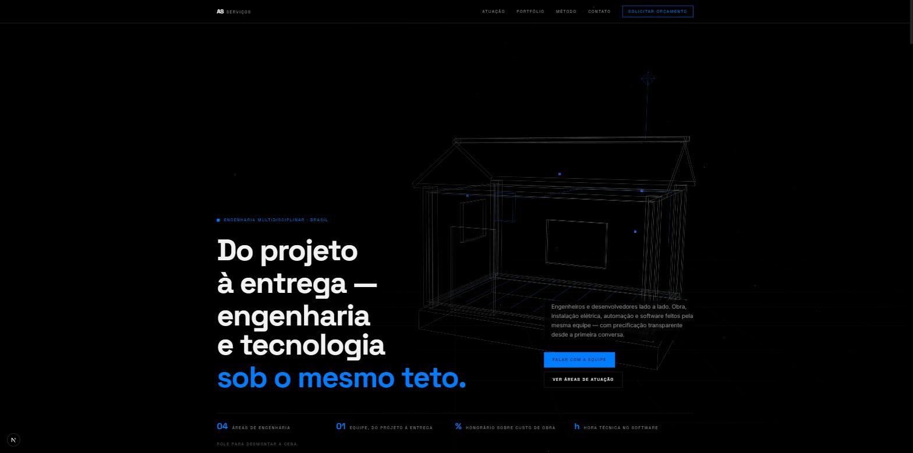

<div align="center">

# AS Serviços

**Engenharia e tecnologia sob o mesmo teto.**

Site institucional da AS Serviços — engenharia civil, elétrica, eletrônica/automação
e desenvolvimento de software — com uma cena 3D procedural em Three.js que
transforma uma casa em wireframe em uma placa-mãe conforme a página é rolada.

[](https://nextjs.org)
[](https://react.dev)
[](https://www.typescriptlang.org)
[](https://threejs.org)
[](https://tailwindcss.com)
[](https://pnpm.io)



</div>

---

## Sobre o projeto

A AS Serviços atua em quatro frentes de engenharia — civil, elétrica,
eletrônica/automação e software — sob a mesma equipe e o mesmo orçamento. O site
usa essa premissa como conceito visual: a cena de fundo do hero é uma **casa
wireframe construída peça por peça em Three.js** que, ao rolar a página, se
transforma em uma **placa-mãe** — a mesma lógica de engenharia aplicada ao
mundo físico e ao digital.

Não há nenhum modelo 3D externo (`.glb`/`.obj`) no projeto: cada aresta da casa
e da placa é gerada em runtime a partir de primitivas do Three.js
(`BoxGeometry`, `CylinderGeometry`, `EdgesGeometry`), com uma câmera que
percorre um trajeto de *keyframes* e um sistema de partículas que "explode" e
recompõe cada peça conforme o progresso do scroll.

## Destaques técnicos

- **Motor 3D procedural** (`lib/three/engine.ts`) — sem assets externos; casa e
  placa-mãe inteiramente geradas em código, com detecção adaptativa de
  qualidade (`cores`, `deviceMemory`, tipo de conexão, `prefers-reduced-motion`)
  para degradar graciosamente em aparelhos mais limitados.
- **Scroll como eixo de tempo** — a cena não usa animações fixas: câmera,
  opacidade, explosão das peças e paralaxe do mouse são todos funções puras do
  progresso de scroll (0–1), suavizadas por interpolação exponencial por
  quadro.
- **Galeria de portfólio com scroll "pinado"** (`components/site/portfolio.tsx`)
  — em telas grandes, a seção gruda na tela por uma faixa maior de rolagem e os
  cards entram em cascata conforme o progresso do scroll dentro dessa faixa,
  como uma sequência animada controlada pelo usuário. O grid se auto-ajusta em
  escala para nunca ficar encoberto pelo header fixo. Em telas menores, cai de
  volta para uma revelação simples ao entrar na viewport.
- **Motion system consistente** (`components/motion/reveal.tsx`) — todas as
  entradas de conteúdo usam o mesmo primitivo baseado em `IntersectionObserver`
  + [anime.js](https://animejs.com), com fallback estático completo para
  `prefers-reduced-motion`.
- **100% tipado, sem `any`** — TypeScript estrito ponta a ponta, do motor 3D ao
  Server Action do formulário de contato.

## Stack

| Camada       | Tecnologia                                                        |
| ------------ | ------------------------------------------------------------------ |
| Framework    | [Next.js 16](https://nextjs.org) (App Router, Server Actions)      |
| UI           | [React 19](https://react.dev) + [Tailwind CSS 4](https://tailwindcss.com) + [shadcn](https://ui.shadcn.com) |
| 3D           | [three.js](https://threejs.org) — cena procedural própria, sem assets externos |
| Animação     | [anime.js v4](https://animejs.com)                                  |
| Ícones       | [lucide-react](https://lucide.dev)                                  |
| Analytics    | [@vercel/analytics](https://vercel.com/docs/analytics)              |
| Linguagem    | TypeScript (strict)                                                 |
| Gerenciador  | [pnpm](https://pnpm.io) (workspace)                                 |

## Como rodar

Pré-requisitos: **Node.js 20+** e **pnpm**.

```bash
# instalar dependências
pnpm install

# ambiente de desenvolvimento em http://localhost:3000
pnpm dev

# build de produção
pnpm build
pnpm start

# lint
pnpm lint
```

## Estrutura do projeto

```
├─ app/
│  ├─ actions/contact.ts     # Server Action do formulário de contato (validação inline)
│  ├─ layout.tsx             # metadata, fontes (Inter / Space Grotesk), analytics
│  └─ page.tsx               # composição das seções da landing page
├─ components/
│  ├─ scene/scene-canvas.tsx # ponte entre o scroll do DOM e o SceneEngine
│  ├─ motion/reveal.tsx      # primitivo de reveal-on-scroll reutilizável
│  ├─ site/                  # seções da página (hero, áreas, portfólio, método, contato…)
│  └─ ui/                    # primitivos de UI (shadcn)
├─ lib/
│  ├─ three/engine.ts        # motor 3D procedural (casa ↔ placa-mãe)
│  └─ site-data.ts           # conteúdo estrutural do site (áreas, portfólio, contatos)
└─ public/                   # ícones, imagens de portfólio
```

## Design system

Paleta minimalista em três cores — quase-preto, branco/cinza claro e azul
elétrico — definida em tokens OKLCH (`app/globals.css`). Todo o layout usa
`border-radius: 0`, reforçando a estética de "planta técnica/blueprint" que
conversa com a cena 3D de fundo.

## Licença

Código proprietário da AS Serviços, publicado como referência técnica e de
portfólio. Todos os direitos reservados — uso, cópia ou redistribuição
requerem autorização prévia.
